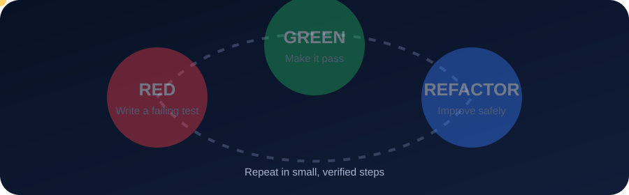

<div align="center">


[](https://git.io/typing-svg)


</div>

# ITDS362: Test-Driven Development

แบบฝึกหัด Kitchen Quantity พัฒนาด้วยวงจร **Red–Green–Refactor** โดยมีประวัติ commit แยกแต่ละขั้นไว้เป็นหลักฐาน

## Red–Green–Refactor คืออะไร

<div align="center">



</div>

- **RED:** เขียนเทสต์ของพฤติกรรมใหม่ก่อน แล้วรันเพื่อยืนยันว่าเทสต์ล้มเหลวจริง
- **GREEN:** เขียนโค้ดให้น้อยที่สุดเพื่อทำให้เทสต์ใหม่และเทสต์เดิมทั้งหมดผ่าน
- **REFACTOR:** ลดความซ้ำซ้อนและปรับโครงสร้าง โดยรักษาให้เทสต์ทั้งหมดยังผ่าน

ตัวอย่างจากงานนี้คือ commit `A2 RED` เพิ่มกรณี `200 × 2 = 400` ซึ่งทำให้โค้ดที่คืนค่า 600 ตลอดล้มเหลว จากนั้น commit `A2 GREEN` จึงเปลี่ยนเป็นการคำนวณ `amount * multiplier` วิธีนี้คือ **Triangulate**

## พฤติกรรมที่พัฒนา

- คูณปริมาณโดยไม่แก้ไขอ็อบเจ็กต์เดิม
- เปรียบเทียบปริมาณด้วยจำนวนและหน่วย
- บวกปริมาณหน่วยเดียวกันและต่างหน่วย
- กำหนดอัตราแปลงหน่วยผ่าน `Converter`
- คูณนิพจน์ผลบวก เช่น `(200 g + 1 oz) × 2`

การออกแบบใช้ `Quantity` เป็น value object, `Sum` เก็บนิพจน์การบวก และ `Converter` ลดรูปผลลัพธ์ไปยังหน่วยที่ต้องการ

## วิธีรันเทสต์

```bash
source .venv/bin/activate
pytest -q
```

ผลลัพธ์ปัจจุบัน: `8 passed`

```text
........  [100%]
8 passed
```

รายละเอียดการทบทวนกระบวนการอยู่ใน [REFLECTION.md](REFLECTION.md)

<div align="center">


</div>
